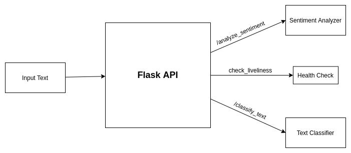

# tweets-text-model

This project contains a classifier for classifying a text to its respective category as well as sentiment analyzer that predicts the sentiment of a given text.

The project is structured in the following way:

- app.py : An API script written using Flask with endpoints for text classification and sentiment analysis

- ClassifierTrainer.py : A training script for the classifier model which can be used to train a XGBoost model for classification purposes. Any excel file can passed as a parameter to it and a model can be trained on it.

- TextClassifer.py: Classifier script to classify a text to its respective category when given a text. Can be used for classification of all texts from all domains provided the correct model is loaded.

- classifier_configs.py: This file contains all configurations and paths for the classifier models. It is needed by the TextClassifier.py script when loading a model.

- SentimentAnalyzer.py: The Sentiment Analysis module is present in this script. Given a text, it predicts the sentiment of a text.

**NOTE:** Each of the scripts contain a main function which can be seen as an example of how to run the script. Each scripts are independent and can be run without depending on the other scripts.

**NOTE:** Please install all libraries and modules mentioned in requirements.txt before running.

## Flow Diagram

